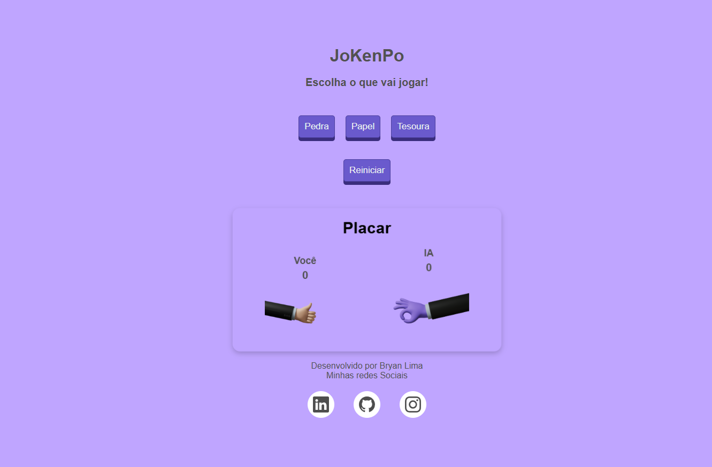

# 🎮 JoKenPo - Pedra, Papel e Tesoura

Este é um jogo clássico de **Pedra, Papel e Tesoura** feito com **HTML, CSS e JavaScript**! Teste suas habilidades contra a IA e veja quem consegue mais pontos.  

## 📌 Funcionalidades

- ✅ Escolha entre **Pedra, Papel ou Tesoura**  
- ✅ O jogo exibe a jogada do jogador e da IA  
- ✅ O placar é atualizado automaticamente  
- ✅ Possibilidade de reiniciar o jogo  

## 🚀 Como jogar?  

1. Clique em **Pedra, Papel ou Tesoura** para fazer sua jogada.  
2. A IA faz uma escolha aleatória.  
3. O jogo exibe o resultado (**Vitória, Derrota ou Empate**).  
4. O placar é atualizado conforme as rodadas.  
5. Clique em **"Reiniciar"** para zerar o jogo.  

## 🖼️ Imagem do Jogo  

  

## 🛠️ Tecnologias utilizadas

- **HTML** para a estrutura  
- **CSS** para o estilo  
- **JavaScript** para a lógica do jogo  

## 📂 Como executar o projeto?

1. Clone este repositório:  

```sh
git clone https://github.com/bry7n/jokenpo.git
